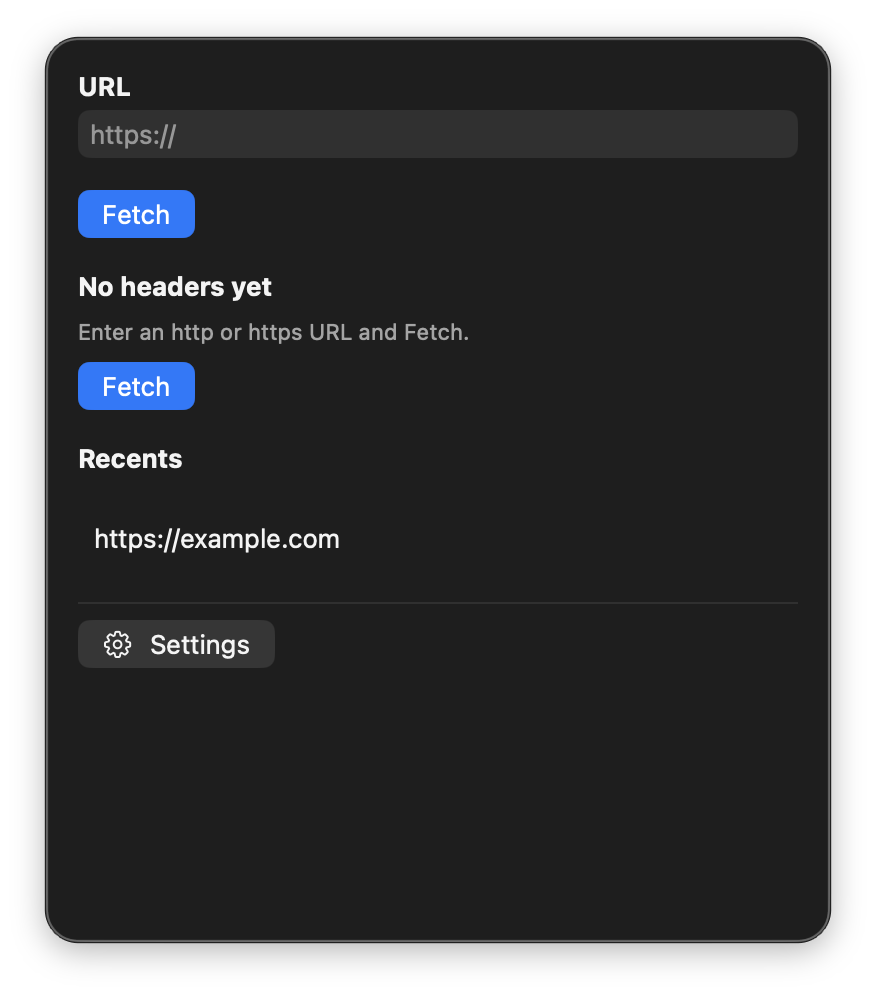

# Header Peek

[](https://github.com/BadryansahBangsawan/header-peek/actions/workflows/ci.yml)

See status, redirects, CORS, cache, CSP, and HSTS for a URL — one hop at a time.

Menu extra for macOS 14+. It lives on the **right** of the menu bar and does not show a Dock icon.



| | |
|---|---|
| Product | `HeaderPeek` |
| Bundle ID | `engineer.badry.headerpeek` |
| Status item | SF Symbol `globe` (title: last HTTP status, or `Header Peek`) |
| Panel | opaque ~360×420 pt |

## Features

- Accepts `http` and `https` only.
- Each hop tries `HEAD`, then `GET` if the server rejects `HEAD` (`405` / `501`) or the request errors.
- Follows `Location` for at most 10 redirects. URLSession does not auto-follow.
- Lists CORS, cache, CSP, HSTS, and server headers first. Everything else is under **Other**.
- **Copy as curl** and **Copy headers**. Recents cap at 20.

## Requirements

- macOS 14 Sonoma or later
- Swift 5.9 or later (Xcode or Command Line Tools) only if you build from source
- Network for Fetch

## Install

```bash
git clone https://github.com/BadryansahBangsawan/header-peek.git
cd header-peek
bash package-app.sh
ditto dist/HeaderPeek.app /Applications/HeaderPeek.app
xattr -cr /Applications/HeaderPeek.app
open /Applications/HeaderPeek.app
```

Ad-hoc signed (`codesign -s -`). If Gatekeeper blocks it or says it is damaged, run the `xattr` line. If it is still blocked: System Settings → Privacy & Security → Open Anyway.

Do not run `dist/HeaderPeek.app` while `/Applications/HeaderPeek.app` is running (same bundle ID).

Enable **Open at Login** from Settings if you want it after reboot.

## How to open

This is an `LSUIElement` extra. Proof it is running is the **globe** status item on the **right** of the menu bar, not a window from Finder or Launchpad.

1. Click that extra. The panel is opaque (~360×420), not a 10px strip.
2. If the bar is full, look behind the Control Center overflow chevron **«**.
3. Double-clicking the app in Finder/Launchpad only changes the left-side app name. That is expected. There is no Dock icon.

## Usage

1. Click the extra.
2. Enter an `https://` URL and click **Fetch**.
3. Read each hop: method, status, duration, then interesting headers.
4. **Copy as curl** copies `curl -sS -D - -o /dev/null --max-redirs 10 -L '<url>'`.
5. **Copy headers** copies the last hop as `Name: value` lines.
6. Click a recent to prefill the field.
7. **Settings** at the bottom of the panel: Open at Login, Quit.

### Example

`https://example.com` → `HEAD 200`. Menu title becomes `200`.

`ftp://example.com` → red **URL must be http or https.** No request is sent.

## Permissions

Network only. No Accessibility or Screen Recording.

## Data

| What | Where |
|---|---|
| Recents | `~/Library/Application Support/Header Peek/recents.json` |
| Open at Login | `SMAppService.mainApp` |

A missing recents file is an empty list. A file that will not decode is an empty list plus a red banner. The app does not crash.

## Privacy

Fetch uses an ephemeral `URLSession` (no cookies). The URL you type leaves this Mac only as that HTTP request.

## Uninstall

Delete `/Applications/HeaderPeek.app`. Turn off Open at Login in Settings first if you enabled it.

```bash
rm -rf "$HOME/Library/Application Support/Header Peek"
```

## Troubleshooting

| What you see | What to do |
|---|---|
| Finder “opens” nothing / no Dock icon | Click the **globe** extra on the right of the menu bar. |
| Extra missing | Overflow **«**, or `pgrep -x HeaderPeek` then `open /Applications/HeaderPeek.app`. |
| “Damaged” / cannot verify | `xattr -cr /Applications/HeaderPeek.app`. `spctl --assess` is `rejected` even when it runs. |
| **URL must be http or https.** | Use an `http` or `https` URL. |
| **Invalid URL** | The field is empty or not a URL. |
| Field rejects `example.com` | Prefix `https://`. The extra only accepts `http`/`https` URLs, not a bare host. |
| **Stopped after 10 redirects.** | The URL redirected more than 10 times. |
| ~10px empty strip under the bar | Reinstall from this repo (panel min height 420). |

## Development

```bash
swift build
swift build -c release --product HeaderPeek
bash package-app.sh
```

Layout: `Sources/` (SwiftPM executable), `Info.plist`, `Assets/AppIcon.icns`, `package-app.sh`. Never commit `dist/`. `FunTheme.swift` is copied verbatim (no shared package).

## License

[MIT](LICENSE)
